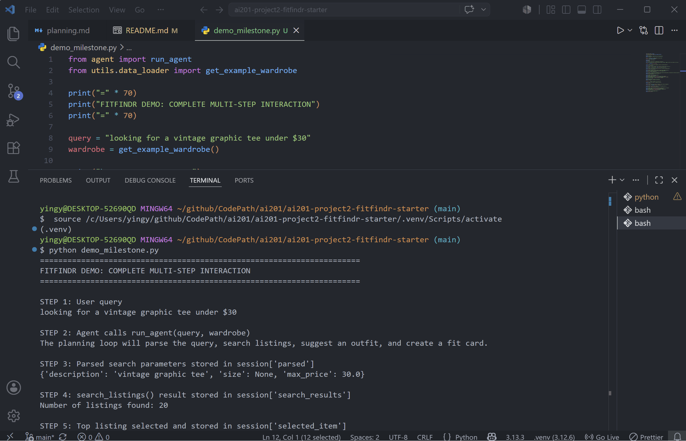

# FitFindr — Starter Kit

This starter kit contains everything you need to begin Project 2.

## What's Included

```
ai201-project2-fitfindr-starter/
├── data/
│   ├── listings.json          # 40 mock secondhand listings
│   └── wardrobe_schema.json   # Wardrobe format + example wardrobe
├── utils/
│   └── data_loader.py         # Helper functions for loading the data
├── planning.md                # Your planning template — fill this out first
└── requirements.txt           # Python dependencies
```

## Setup

```bash
pip install -r requirements.txt
```

Set your Groq API key in a `.env` file (get a free key at [console.groq.com](https://console.groq.com)):

```
GROQ_API_KEY=your_key_here
```

## The Mock Listings Dataset

`data/listings.json` contains 40 mock secondhand listings across categories (tops, bottoms, outerwear, shoes, accessories) and styles (vintage, y2k, grunge, cottagecore, streetwear, and more).

Each listing has: `id`, `title`, `description`, `category`, `style_tags`, `size`, `condition`, `price`, `colors`, `brand`, and `platform`.

Load it with:

```python
from utils.data_loader import load_listings
listings = load_listings()
```

## The Wardrobe Schema

`data/wardrobe_schema.json` defines the format your agent uses to represent a user's existing wardrobe. It includes:

- `schema`: field definitions for a wardrobe item
- `example_wardrobe`: a sample wardrobe with 10 items you can use for testing
- `empty_wardrobe`: a starting template for a new user

Load an example wardrobe with:

```python
from utils.data_loader import get_example_wardrobe
wardrobe = get_example_wardrobe()
```

## Where to Start

1. **Read `planning.md` and fill it out before writing any code.**
2. Verify the data loads correctly by running `python utils/data_loader.py`.
3. Build and test each tool individually before connecting them through your planning loop.

Your implementation files go in this same directory. There's no required file structure for your agent code — organize it however makes sense for your design.

## Tool Inventory

List every tool your agent will use. For each tool, fill in all four fields.
You must have at least 3 tools. The three required tools are listed — add any additional tools below them.

### Tool 1: search_listings

**Purpose:**
Searches the mock thrift listings dataset for clothing items that match the user's description. It can optionally filter by size and maximum price, then returns the best matching listings first.

**Inputs:**

- `description` (`str`): Keywords describing the item the user is looking for, such as `"vintage graphic tee"`.
- `size` (`str | None`): Optional size filter, such as `"S"`, `"M"`, or `"L"`. If `None`, size filtering is skipped.
- `max_price` (`float | None`): Optional maximum price filter. If `None`, price filtering is skipped.

**Output:**
Returns a list of matching listing dictionaries sorted by relevance. Each listing may include fields such as `id`, `title`, `description`, `category`, `style_tags`, `size`, `condition`, `price`, `colors`, `brand`, and `platform`.

---

### Tool 2: suggest_outfit

**Purpose:**
Suggests 1–2 complete outfits using the thrifted item selected by the agent. If the user has wardrobe items saved, it uses those specific pieces. If the wardrobe is empty, it gives general styling advice.

**Inputs:**

- `new_item` (`dict`): The selected thrift listing dictionary.
- `wardrobe` (`dict`): The user's wardrobe dictionary. It contains an `"items"` key whose value is a list of wardrobe item dictionaries. The list may be empty.

**Output:**
Returns a non-empty string containing outfit suggestions. With a populated wardrobe, the suggestion can reference named wardrobe pieces. With an empty wardrobe, the tool returns general styling advice instead of failing.

---

### Tool 3: create_fit_card

**Purpose:**
Generates a short, shareable outfit caption based on the selected thrift item and the outfit suggestion.

**Inputs:**

- `outfit` (`str`): The outfit suggestion returned by `suggest_outfit()`.
- `new_item` (`dict`): The selected thrift listing dictionary.

**Output:**
Returns a 2–4 sentence social-media-style caption. If the outfit string is empty, missing, or only whitespace, it returns a descriptive error message string instead of raising an exception.

---

## Planning Loop

The agent uses a session dictionary to decide which tool to call next. First, `run_agent(query, wardrobe)` creates a new session using `_new_session(query, wardrobe)`. Then it parses the natural language query into three search parameters: `description`, `size`, and `max_price`.

The agent uses simple string parsing and regular expressions for this step because the expected search queries are small and predictable. For example, `"vintage graphic tee under $30"` becomes:

```python
{
    "description": "vintage graphic tee",
    "size": None,
    "max_price": 30.0
}
```

After parsing, the agent calls `search_listings(description, size, max_price)` and stores the result in `session["search_results"]`.

The main conditional branch happens after search. If `search_listings()` returns an empty list, the agent sets `session["error"]` to a helpful message and returns early. It does not call `suggest_outfit()` or `create_fit_card()` because there is no selected item to style.

If search results exist, the agent selects the first result as the top match and stores it in `session["selected_item"]`. Then it calls `suggest_outfit()` with that selected item and the user's wardrobe. The returned outfit text is stored in `session["outfit_suggestion"]`.

If the outfit suggestion is valid, the agent calls `create_fit_card()` with `session["outfit_suggestion"]` and `session["selected_item"]`. The returned caption is stored in `session["fit_card"]`. The agent is done when either an error is set or the session contains a selected item, outfit suggestion, and fit card.

---

## State Management

FitFindr stores all information for one interaction in a session dictionary. This keeps the planning loop from using hardcoded values or re-prompting the user between tools.

The session stores:

- `query`: The original user request.
- `parsed`: The extracted `description`, `size`, and `max_price`.
- `search_results`: The list returned by `search_listings()`.
- `selected_item`: The first/top listing selected from the search results.
- `wardrobe`: The user's wardrobe dictionary.
- `outfit_suggestion`: The string returned by `suggest_outfit()`.
- `fit_card`: The string returned by `create_fit_card()`.
- `error`: A helpful error message if the agent stops early, or `None` if successful.

State flows between tools in order. The parsed query values are passed into `search_listings()`. The first search result is saved as `session["selected_item"]` and passed into `suggest_outfit()` as `new_item`. The outfit suggestion is saved as `session["outfit_suggestion"]` and then passed into `create_fit_card()` with the same selected item.

```python
suggest_outfit(
    new_item=session["selected_item"],
    wardrobe=session["wardrobe"]
)
```

```python
create_fit_card(
    outfit=session["outfit_suggestion"],
    new_item=session["selected_item"]
)
```

If an early failure occurs, such as no matching listings, the agent stores the message in `session["error"]` and returns the session before calling later tools.

---

## Error Handling

| Tool              | Failure mode                                            | Strategy                                                                                                                                                                                   | Tested example                                                                                                                                                                                                                                                                                                                                     |
| ----------------- | ------------------------------------------------------- | ------------------------------------------------------------------------------------------------------------------------------------------------------------------------------------------ | -------------------------------------------------------------------------------------------------------------------------------------------------------------------------------------------------------------------------------------------------------------------------------------------------------------------------------------------------- |
| `search_listings` | No listings match the query.                            | The tool returns `[]` instead of raising an exception. The agent sets `session["error"]` to a helpful message and returns early without calling `suggest_outfit()` or `create_fit_card()`. | I ran `search_listings('designer ballgown', size='XXS', max_price=5)` and it returned `[]`. I also ran the full agent with `"designer ballgown size XXS under $5"`, and it returned the message: `"No listings matched your search. Try broadening your keywords, removing the size filter, or increasing your max price."` with `fit_card: None`. |
| `suggest_outfit`  | The wardrobe is empty.                                  | The tool does not fail. Instead of using named wardrobe pieces, it asks the LLM for general styling advice based on the selected thrifted item.                                            | I ran `suggest_outfit(results[0], get_empty_wardrobe())` after searching for `"vintage graphic tee"`. The tool returned a non-empty styling suggestion with general outfit advice instead of raising an exception.                                                                                                                                 |
| `create_fit_card` | The outfit input is empty, missing, or only whitespace. | The tool returns a descriptive error message string instead of raising a Python exception.                                                                                                 | I ran `create_fit_card('', results[0])`, and it returned: `"Cannot create a fit card because the outfit suggestion is missing or empty."`                                                                                                                                                                                                          |

---

## Spec Reflection

The planning spec helped me keep the agent organized around clear tool boundaries and session state. Because the Planning Loop and State Management sections already defined the order of tool calls and the session keys, I was able to implement `run_agent()` without hardcoding values between steps. The spec also helped me catch the important branch where `search_listings()` returns an empty list and the agent must stop early.

One way the implementation diverged from the original plan was in the query parsing. Instead of using an LLM to parse the user query, I used simple regular expressions and string cleanup. I chose this because the expected query patterns were small and predictable, such as `"under $30"` or `"size M"`. This made the agent easier to test and avoided unnecessary LLM calls for a simple parsing task.

---

## AI Usage

### Instance 1: Implementing and refining `tools.py`

**What I gave the AI:**
I gave the AI my Tool Inventory section from `planning.md`, including the required inputs, outputs, and failure behavior for `search_listings()`, `suggest_outfit()`, and `create_fit_card()`. I also included the starter TODO comments from `tools.py`.

**What it produced:**
The AI helped generate implementations for the three tools. It suggested loading listings with `load_listings()`, filtering by size and maximum price, scoring listings by keyword overlap, formatting wardrobe items for the LLM prompt, and guarding against empty outfit input in `create_fit_card()`.

**What I changed or overrode:**
I reviewed the generated code against my spec and revised parts of it. For example, I kept `search_listings()` rule-based instead of LLM-based, made sure no-results returned `[]`, and adjusted size matching so a requested size like `"M"` can match a listing size like `"S/M"`. I also made sure `create_fit_card()` checks for an empty outfit string before making an LLM call.

### Instance 2: Implementing the planning loop in `agent.py`

**What I gave the AI:**
I gave the AI my Planning Loop section, State Management section, Error Handling table, Architecture diagram, and the starter `agent.py` code.

**What it produced:**
The AI helped produce a `run_agent()` implementation that initializes a session, parses the query, calls `search_listings()`, stores results, selects the top item, calls `suggest_outfit()`, and then calls `create_fit_card()`.

**What I changed or overrode:**
I specifically checked that the generated planning loop did not call all three tools unconditionally. I kept the early-return branch for no search results so the agent sets `session["error"]` and does not call `suggest_outfit()` or `create_fit_card()`. I also verified that the exact values stored in `session["selected_item"]` and `session["outfit_suggestion"]` were passed into the next tools.

### Instance 3: Implementing `handle_query()` in `app.py`

**What I gave the AI:**
I gave the AI the starter `app.py` file and the TODO steps for `handle_query()`.

**What it produced:**
The AI helped write code that selects either the example wardrobe or empty wardrobe, calls `run_agent()`, checks `session["error"]`, and maps the session dictionary into the three Gradio output panels.

**What I changed or overrode:**
I reviewed the output to make sure the UI did not hide agent errors. I kept the behavior where errors appear in the first output panel while the outfit and fit-card panels remain empty. I also added readable formatting for the selected listing so the user can see the item title, price, platform, size, condition, category, brand, colors, style tags, and description.

## Video Walkthrough



GIF created with **ScreenToGif**
