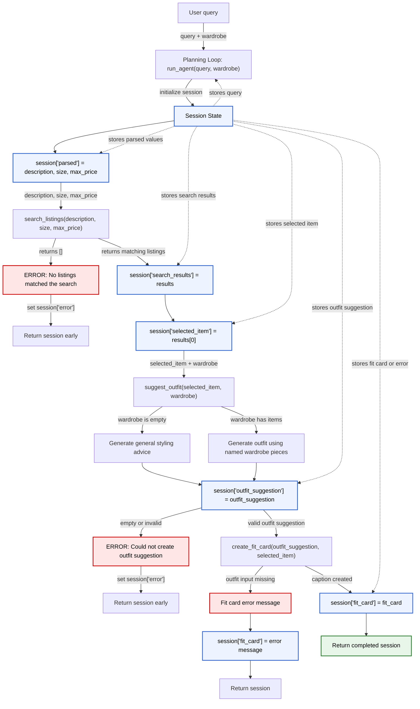

# FitFindr — planning.md

> Complete this document before writing any implementation code.
> Your spec and agent diagram are what you'll use to direct AI tools (Claude, Copilot, etc.) to generate your implementation — the more specific they are, the more useful the generated code will be.
> Your planning.md will be reviewed as part of your submission.
> Update it before starting any stretch features.

---

## Tools

List every tool your agent will use. For each tool, fill in all four fields.
You must have at least 3 tools. The three required tools are listed — add any additional tools below them.

### Tool 1: search_listings

**What it does:**

<!-- Describe what this tool does in 1–2 sentences -->

Searches the mock listings dataset for clothing or item listings that match the user’s description. It can optionally filter results by size and maximum price, then returns the best matching listings first.

**Input parameters:**

<!-- List each parameter, its type, and what it represents -->

- `description` (str): Keywords describing what the user is looking for, such as "vintage graphic tee".
- `size` (str| None): Optional size filter, such as "S", "M", or "L". If provided, the tool only returns listings with matching sizes. Matching is case-insensitive.
- `max_price` (float| None): Optional maximum price filter. If provided, the tool only returns listings with a price less than or equal to this amount.

**What it returns:**

<!-- Describe the return value — what fields does a result contain? -->

Returns a list of matching listing dictionaries, sorted by relevance with the best match first. Each result contains fields such as id, title, description, category, style_tags, size, condition, price, colors, brand, and platform.

**What happens if it fails or returns nothing:**

<!-- What should the agent do if no listings match? -->

The tool does not raise an error if no listings match. It returns an empty list. If this happens, the agent should clearly tell the user that no matching listings were found and suggest broadening the search, removing the size filter, increasing the maximum price, or trying different keywords.

---

### Tool 2: suggest_outfit

**What it does:**

<!-- Describe what this tool does in 1–2 sentences -->

Suggests 1–2 complete outfits using a thrifted item the user is considering buying. If the user has wardrobe items saved, it uses those specific pieces; if the wardrobe is empty, it gives general styling advice for the new item.

**Input parameters:**

<!-- List each parameter, its type, and what it represents -->

- `new_item` (dict): A listing dictionary representing the thrifted item the user is considering. It may include fields such as title, description, category, style_tags, size, condition, price, colors, brand, and platform.
- `wardrobe` (dict): A dictionary representing the user’s existing wardrobe. It should contain an "items" key, where the value is a list of wardrobe item dictionaries. The list may be empty.

**What it returns:**

<!-- Describe the return value -->

Returns a non-empty string containing outfit suggestions. If the wardrobe has items, the response should suggest specific outfit combinations using the new item and named pieces from the user’s wardrobe. If the wardrobe is empty, the response should give general styling ideas, such as what colors, clothing types, shoes, or accessories would pair well with the item.

**What happens if it fails or returns nothing:**

<!-- What should the agent do if the wardrobe is empty or no outfit can be suggested? -->

If the wardrobe is empty, the tool should not fail or return an empty string. Instead, it should provide general styling advice based on the thrifted item. If no clear outfit can be suggested from the wardrobe, the agent should explain that there were not enough matching wardrobe pieces and suggest general alternatives or recommend what type of item the user could add to complete the outfit.

---

### Tool 3: create_fit_card

**What it does:**

<!-- Describe what this tool does in 1–2 sentences -->

Generates a short, shareable outfit caption for a thrifted item based on an outfit suggestion. The caption is meant to sound casual and authentic, like an Instagram or TikTok outfit-of-the-day post.

**Input parameters:**

<!-- List each parameter, its type, and what it represents -->

- `outfit` (str): The outfit suggestion string returned by suggest_outfit(). This describes how the thrifted item could be styled.
- `new_item` (dict): The listing dictionary for the thrifted item. It may include fields such as title, price, platform, description, category, style_tags, colors, brand, and condition.

**What it returns:**

<!-- Describe the return value -->

Returns a 2–4 sentence string that can be used as a social media caption. The caption should naturally mention the thrifted item’s name, price, and platform once each, while also describing the outfit’s specific vibe.

**What happens if it fails or returns nothing:**

<!-- What should the agent do if the outfit data is incomplete? -->

If the `outfit` string is empty, missing, or only whitespace, the tool should return a descriptive error message string instead of raising an exception. If the item data is incomplete, the agent should still create the best possible caption using the available details, but avoid inventing missing information such as price or platform.

---

### Additional Tools (if any)

<!-- Copy the block above for any tools beyond the required three -->

---

## Planning Loop

**How does your agent decide which tool to call next?**

<!-- Describe the logic your planning loop uses. What does it look at? What conditions change its behavior? How does it know when it's done? -->

The agent decides which tool to call next by looking at the current session state and checking what information is still missing. The session stores the original query, parsed search parameters, search results, the selected item, the wardrobe, the outfit suggestion, the fit card caption, and any error message.

First, the agent initializes a new session using `_new_session(query, wardrobe)`. Then it parses the user’s natural language query into the parameters needed by `search_listings`: `description`, `size`, and `max_price`.

I will use simple string parsing and regular expressions instead of an LLM for this step because the expected inputs are small and predictable. For example, the agent can detect phrases like `"under $30"` for `max_price`, `"size M"` for `size`, and use the remaining item-related words as the `description`.

For example, this query:

```python
"looking for a vintage graphic tee under $30"
```

would be parsed as:

```python
{
    "description": "vintage graphic tee",
    "size": None,
    "max_price": 30.00
}
```

After parsing, the agent stores the result in `session["parsed"]`. Then it calls `search_listings` using those parsed values.

If `search_listings` returns no results, the agent sets `session["error"]` to a helpful message and returns the session early. It does not continue to `suggest_outfit` because there is no item to style.

If matching listings are found, the agent saves them in `session["search_results"]`. Since `search_listings` returns results sorted by relevance, the agent selects the first result and stores it in `session["selected_item"]`.

Next, the agent calls `suggest_outfit` with the selected item and the user’s wardrobe. The returned outfit suggestion is stored in `session["outfit_suggestion"]`. If the wardrobe is empty, `suggest_outfit` should still return general styling advice instead of failing.

Finally, the agent calls `create_fit_card` with the outfit suggestion and selected item. The returned caption is stored in `session["fit_card"]`.

The agent knows it is done when either an error has been set or the session contains a selected item, an outfit suggestion, and a fit card caption. The completed session is then returned.

---

## State Management

**How does information from one tool get passed to the next?**

<!-- Describe how your agent stores and accesses state within a session. What data is tracked? How is it passed between tool calls? -->

The agent passes information between tools by storing everything in a session dictionary. This session dictionary acts as the single source of truth for one user interaction.

The session tracks:

- `query`: The original user request.
- `parsed`: The extracted search parameters, including `description`, `size`, and `max_price`.
- `search_results`: The list of listings returned by `search_listings`.
- `selected_item`: The top listing selected from the search results.
- `wardrobe`: The user’s wardrobe dictionary.
- `outfit_suggestion`: The string returned by `suggest_outfit`.
- `fit_card`: The caption returned by `create_fit_card`.
- `error`: A message explaining why the interaction ended early, or `None` if successful.

The information flows from one tool to the next. First, the parsed query values are passed into `search_listings`. The results from `search_listings` are saved in `session["search_results"]`. The agent then chooses the first result and saves it as `session["selected_item"]`.

That selected item is passed into `suggest_outfit` as the `new_item` argument. The wardrobe from `session["wardrobe"]` is passed as the second argument.

```python
suggest_outfit(
    new_item=session["selected_item"],
    wardrobe=session["wardrobe"]
)
```

The outfit suggestion returned by `suggest_outfit` is saved in `session["outfit_suggestion"]`. Then that outfit suggestion and the selected item are passed into `create_fit_card`.

```python
create_fit_card(
    outfit=session["outfit_suggestion"],
    new_item=session["selected_item"]
)
```

The returned caption is saved in `session["fit_card"]`.

If something goes wrong, such as no listings being found, the agent stores a message in `session["error"]` and returns early. This prevents later tools from being called with missing or invalid data.

---

## Error Handling

For each tool, describe the specific failure mode you're handling and what the agent does in response.

| Tool            | Failure mode                          | Agent response                                                                                                                                                                                                                                                                                                       |
| --------------- | ------------------------------------- | -------------------------------------------------------------------------------------------------------------------------------------------------------------------------------------------------------------------------------------------------------------------------------------------------------------------- |
| search_listings | No results match the query            | The tool returns an empty list. The agent sets session["error"] to a helpful message, such as "No listings matched your search. Try broadening your keywords, removing the size filter, or increasing your max price." Then the agent returns the session early and does not call suggest_outfit or create_fit_card. |
| suggest_outfit  | Wardrobe is empty                     | The tool does not fail. Instead of using named wardrobe pieces, it asks the LLM for general styling advice based on the thrifted item. The agent stores that response in session["outfit_suggestion"] and continues to create_fit_card if the suggestion is non-empty.                                               |
| create_fit_card | Outfit input is missing or incomplete | The tool returns a descriptive error message string instead of raising an exception. The agent stores that message in session["fit_card"] or sets session["error"] if the caption cannot be created. The agent should avoid inventing missing item details like price or platform.                                   |

---

## Architecture

<!-- Draw a diagram of your agent showing how the components connect:
     User input → Planning Loop → Tools (search_listings, suggest_outfit, create_fit_card)
                                                                          ↕
                                                                   State / Session
     Show what triggers each tool, how state flows between them, and where error paths branch off.
     ASCII art, a Mermaid diagram (https://mermaid.js.org/syntax/flowchart.html), or an embedded
     sketch are all fine. You'll share this diagram with an AI tool when asking it to implement
     the planning loop and each individual tool. -->

The diagram below shows how user input moves through the planning loop, how session state is updated after each tool call, and where the agent stops early when an error occurs.



---

## AI Tool Plan

<!-- For each part of the implementation below, describe:
     - Which AI tool you plan to use (Claude, Copilot, ChatGPT, etc.)
     - What you'll give it as input (which sections of this planning.md, your agent diagram)
     - What you expect it to produce
     - How you'll verify the output matches your spec before moving on

     "I'll use AI to help me code" is not a plan.
     "I'll give Claude my Tool 1 spec (inputs, return value, failure mode) and ask it to implement
     search_listings() using load_listings() from the data loader — then test it against 3 queries
     before trusting it" is a plan. -->

**Milestone 3 — Individual tool implementations:**

I plan to use ChatGPT to help implement and review each individual tool in `tools.py`. I will give ChatGPT the Tool 1, Tool 2, and Tool 3 sections from `planning.md`, along with the starter code comments for each function.

For `search_listings`, I will provide the tool description, input parameters, return value, failure mode, and sample `listings.json` data. I expect ChatGPT to help write code that loads listings with `load_listings()`, filters by `size` and `max_price`, scores listings by keyword overlap with the description, removes listings with a score of 0, sorts results by relevance, and returns a list of matching dictionaries.

I will verify `search_listings` by testing at least three queries:

- A successful query, such as `"vintage graphic tee under $30"`
- A size-filtered query, such as `"graphic tee size M under $30"`
- A no-results query, such as `"designer ballgown size XXS under $5"`

For `suggest_outfit`, I will give ChatGPT the tool description, wardrobe schema, example wardrobe, and empty wardrobe case. I expect it to produce a function that checks whether `wardrobe["items"]` is empty, formats wardrobe items clearly for the LLM, and returns either specific outfit combinations or general styling advice.

I will verify `suggest_outfit` by testing it with:

- A selected listing and the example wardrobe
- A selected listing and an empty wardrobe
- A listing with missing optional fields, such as `brand: None`

For `create_fit_card`, I will give ChatGPT the tool description, caption requirements, selected item format, and example outfit suggestion. I expect it to produce a function that guards against empty outfit input, builds an LLM prompt, and returns a 2–4 sentence caption that mentions the item name, price, and platform naturally.

I will verify `create_fit_card` by testing:

- A normal outfit suggestion
- An empty outfit string
- A listing with incomplete optional data

Before moving on, I will run each tool by itself and check that it matches the return types and failure behavior described in `planning.md`.

**Milestone 4 — Planning loop and state management:**

I plan to use ChatGPT to help implement the planning loop in `agent.py`. I will give ChatGPT the Planning Loop section, State Management section, Error Handling table, Architecture diagram, and the starter code for `agent.py`.

I expect ChatGPT to produce a `run_agent()` implementation that follows the planned flow:

1. Initialize the session with `_new_session(query, wardrobe)`.
2. Parse the user query into `description`, `size`, and `max_price`.
3. Store the parsed values in `session["parsed"]`.
4. Call `search_listings`.
5. Store results in `session["search_results"]`.
6. Return early with `session["error"]` if no results are found.
7. Select the top result and store it in `session["selected_item"]`.
8. Call `suggest_outfit`.
9. Store the response in `session["outfit_suggestion"]`.
10. Call `create_fit_card`.
11. Store the caption in `session["fit_card"]`.
12. Return the completed session.

I will verify the planning loop by running the provided CLI tests in `agent.py`. I will check that the happy path returns a selected item, outfit suggestion, and fit card, while the no-results path sets `session["error"]` and does not continue to later tools.

I will also manually inspect the session dictionary after each test to make sure information is being passed correctly between tools. If the generated code does not match my planning diagram or state keys, I will revise it instead of trusting it automatically.

---

## A Complete Interaction (Step by Step)

Write out what a full user interaction looks like from start to finish — tool call by tool call. Use a specific example query.

**Example user query:** "I'm looking for a vintage graphic tee under $30. I mostly wear baggy jeans and chunky sneakers. What's out there and how would I style it?"

**Step 1:**

<!-- What does the agent do first? Which tool is called? With what input? -->

The agent parses the user’s query to identify the search description, size, and maximum price. Since the user asks for a vintage graphic tee under $30 and does not specify a size, the agent calls:

```python
search_listings(
    description="vintage graphic tee",
    size=None,
    max_price=30.00
)
```

**Step 2:**

<!-- What happens next? What was returned from step 1? What tool is called now? -->

`search_listings()` searches `data/listings.json` and returns a ranked list of matching listings. The agent stores the results in `session["search_results"]`, selects the highest-ranked result, and stores it as `session["selected_item"]`.

**Step 3:**

<!-- Continue until the full interaction is complete -->

The agent uses the selected listing and the user’s wardrobe information to call:

```python
suggest_outfit(
    new_item=session["selected_item"],
    wardrobe=session["wardrobe"]
)
```

`suggest_outfit()` returns 1–2 outfit suggestions. If the user’s wardrobe has items, the response uses named wardrobe pieces. If the wardrobe is empty, the response gives general styling advice instead.

**Step 4:**

The agent stores the styling recommendation in session["outfit_suggestion"]. If the suggestion is empty or invalid, the agent sets session["error"] and returns early. If the suggestion is valid, the agent calls:

```python
create_fit_card(
    outfit=session["outfit_suggestion"],
    new_item=session["selected_item"]
)
```

**Step 5:**

`create_fit_card()` returns a short fit-card caption based on the selected item and outfit suggestion. The agent stores the result in `session["fit_card"]`.

**Final output to user:**

<!-- What does the user actually see at the end? -->

The user receives a complete response containing the matched listing, the outfit suggestion, and the fit-card caption. If no listings match the search, the agent tells the user to broaden the search, remove the size filter, increase the budget, or try different keywords, then stops without calling the outfit or caption tools.
